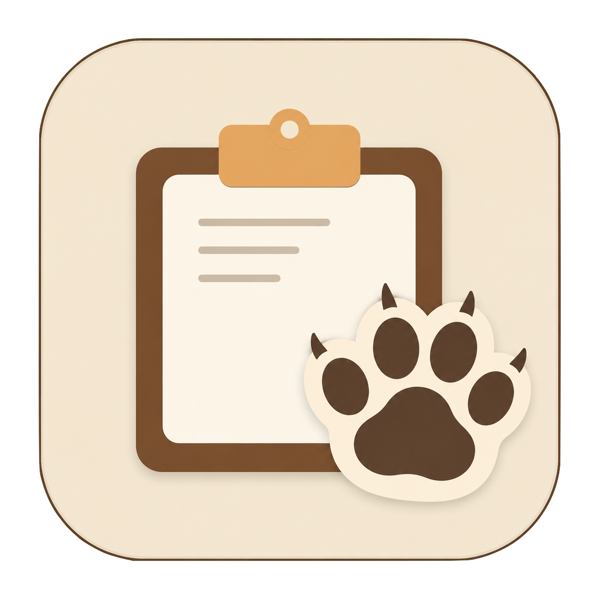

# PastePaw



PastePaw is a cute macOS clipboard history app with a FuFu theme. It keeps recent text and images available from the menu bar, so you can search, pin, delete, and copy items back to the system clipboard without leaving your current workflow.

## Features

- Runs quietly as a macOS menu bar app.
- Saves recent copied text and original-quality images locally.
- Lets you pin important items so they do not expire.
- Supports configurable retention for normal clipboard history.
- Provides quick text search in the main history window.
- Shows recent history in the menu bar for one-click copy back.
- Includes English and Chinese language options.
- Ships with a static product website in `website/`.

## Privacy

PastePaw stores clipboard history locally in Application Support on your Mac. It does not sync, upload, or share your clipboard content.

## Run Locally

Requirements:

- macOS 14 or later
- Swift 6 toolchain

Build and open the macOS app:

```bash
./script/build_and_run.sh
```

Run tests:

```bash
swift test
```

## Website

Preview the static website locally:

```bash
python3 -m http.server 4173 --directory website
```

Then open `http://127.0.0.1:4173`.

Production website:

https://pastepaw.vercel.app

## License

PastePaw is proprietary software. See [LICENSE](LICENSE) for usage terms.
